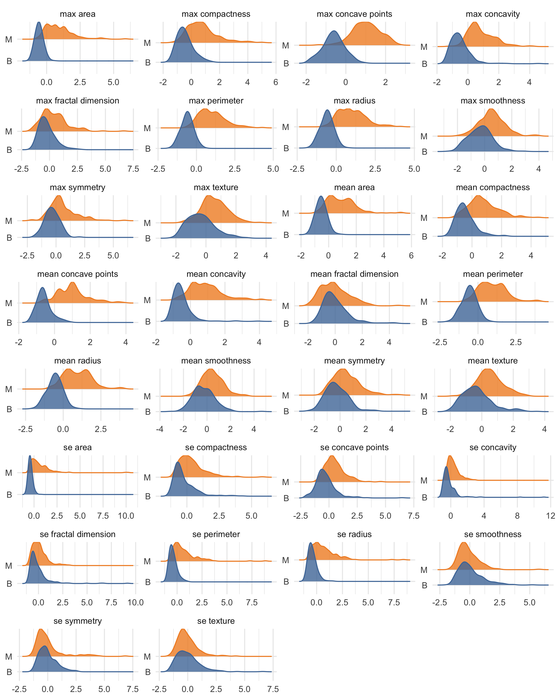
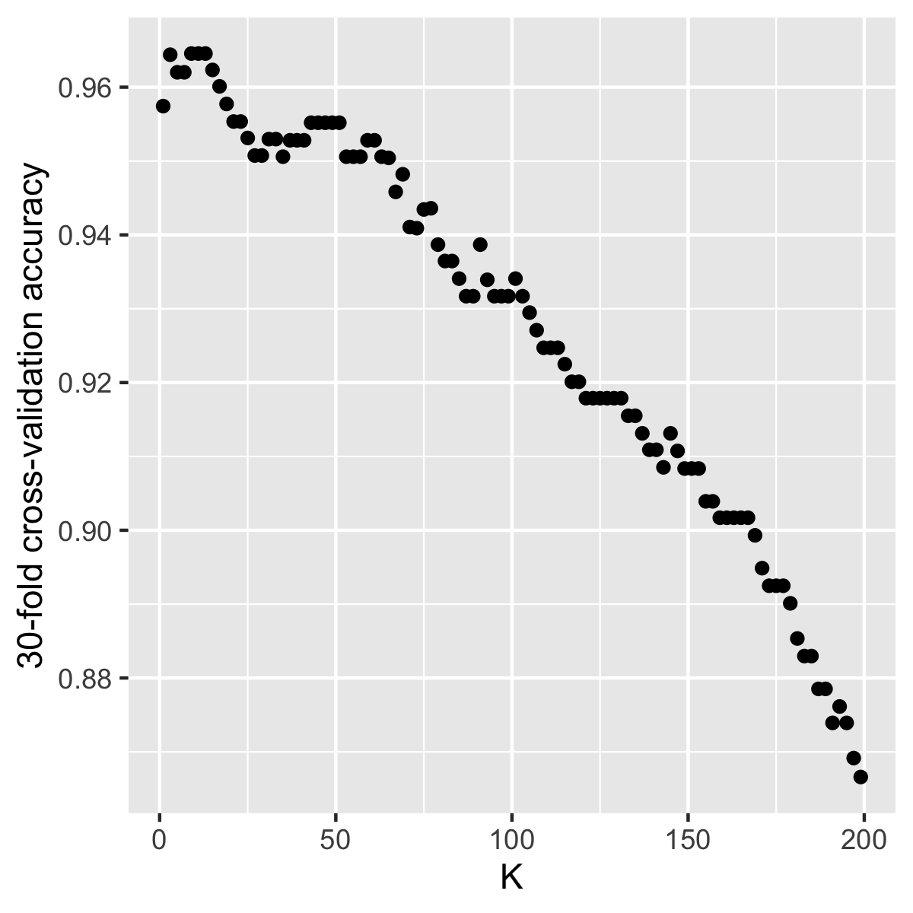

```{r setup, include=FALSE}
knitr::opts_chunk$set(echo = TRUE)
library(knitr)
library(kableExtra)
library(tidyverse)
library(caret)
```

# Summary

# Introduction
For this project we are trying to answer the question: given tumour image measurements is a newly discovered tumour benign or malignant? Answering this question is important because traditional, non-data-driven methods for tumour diagnosis are quite subjective and can depend on the diagnosing physicians skill as well as experience [@Streetetal]. Furthermore, benign tumours are not normally dangerous; the cells stay in the same place and the tumour stops growing before it gets very large. By contrast, in malignant tumours, the cells invade the surrounding tissue and spread into nearby organs where they can cause serious damage. Thus, it is important to quickly and accurately diagnose the tumour type to guide patient treatment. 

# Methods

## Data
The data set used in this project is of digitized breast cancer image features created by Dr. William H. Wolberg, W. Nick Street, and Olvi L. Mangasarian at the University of Wisconsin, Madison [@Streetetal].  It was sourced from the UCI Machine Learning Repository [@Dua2019] and can be found [here](https://archive.ics.uci.edu/ml/datasets/Breast+Cancer+Wisconsin+(Diagnostic)), specifically [this file](http://mlr.cs.umass.edu/ml/machine-learning-databases/breast-cancer-wisconsin/wdbc.data). Each row in the data set represents summary statistics from measurements of an image of a tumour sample, including the diagnosis (benign or malignant) and several other measurements (e.g., nucleus texture, perimeter, area, etc.). Diagnosis for each image was conducted by physicians. 

## Analysis
The k-nearest neighbors (k-nn) algorithm was used to build a classification model to predict whether a tumour mass was benign or malignant (found in the class column of the data set). The remaining 9 variables listed above were used as predictors in the model. The hyperparameter $K$ was chosen using 10-fold cross validation with overall classification accuracy as the loss function. The R and Python programming languages [@R; @Python] and the following R and Python packages were used to perform the analysis: caret [@caret], docopt [@docopt], feather [@feather], knitr [@knitr], tidyverse [@tidyverse], docopt [@docoptpython], os [@Python], feather [@feather] Pandas [@mckinney-proc-scipy-2010]. The code used to perform the analysis and create this report can be found here: https://github.com/ttimbers/breast_cancer_predictor.

# Results & Discussion

To look at whether each of the predictors might be useful to predict the tumour class, we plotted the distributions of each predictor from the training data set and coloured the distribution by class (benign: blue and malignant: orange). In doing this we see that class distributions for all of the mean and max predictors for all the measurements overlap somewhat, but do show quite a difference in their centres and spreads. This is less so for the standard error (se) predictors. In particular, the standard errors of fractal dimension, smoothness, symmetry and texture look very similar in both the distribution centre and spread. Thus, we might choose to omit these from our model.

```{r predictor-distributions, echo=FALSE, fig.cap="Figure 1. Comparison of the empirical distributions of training data predictors between benign and malignant tumour masses.", out.width = '90%'}

```

Using 30-fold cross validation to choose K:

```{r choosing-k, echo=FALSE, fig.cap="Figure 2. 30-fold cross validation classification accuracy as K is varied.", out.width = '40%'}

```


```{r model-quality, echo=FALSE}
model_quality <- readRDS("../results/final_model_quality.rds")
```

Our prediction model performed quite well on test data, with a final overall accuracy calculated to be `r round(model_quality$overall[1], 2)`. Other indicators that our model performed well come from the confusion matrix, where it only made 7 mistakes. However all 7 mistakes were predicting a malignant tumour as benign, given the impications this has for patients health, this model is not good enough to yet implement in the clinic.


```{r confusion-matrix, echo=FALSE}
kable(model_quality$table, caption = "Table 1. Confusion matrix of model performance on test data.") %>%
  kable_styling() %>%
  add_header_above(c(" ", "Reference" = 2)) %>% 
  pack_rows("Predicted", 1, 2)
```


# References

